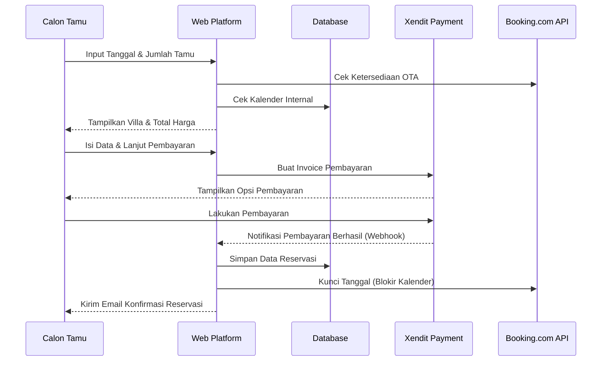
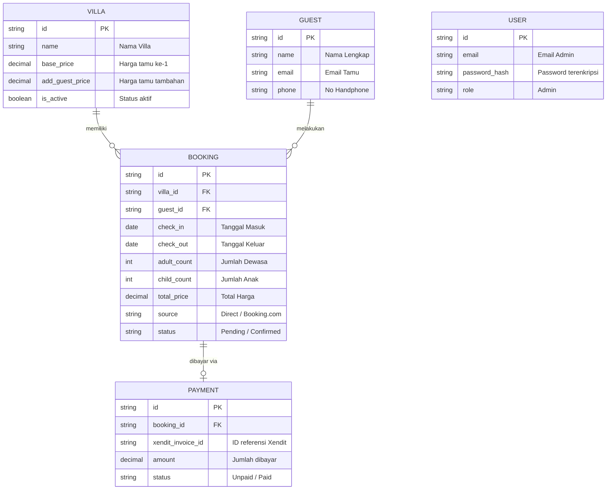

# PRD — Project Requirements Document

## 1. Overview
Aplikasi ini adalah platform reservasi (booking) website independen untuk manajemen penyewaan 3 unit villa eksklusif (Double & Twin Rooms, Scar Reef Villa, dan Beach House). Masalah utama yang ingin diselesaikan adalah mempermudah calon tamu untuk mencari ketersediaan villa, menghitung harga secara otomatis berdasarkan jumlah dan tipe tamu (dewasa/anak-anak), serta melakukan pembayaran langsung. Selain itu, sistem ini dirancang untuk mencegah terjadinya pemesanan ganda (*double booking*) dengan melakukan sinkronisasi otomatis menggunakan Booking.com. Untuk pengelola, sistem menyediakan *dashboard* admin yang lengkap untuk mengelola konten, pesanan, dan melihat laporan keuangan secara mudah.

## 2. Requirements
- **Sistem Pemesanan Mandiri:** Pengunjung dapat memilih tanggal *check-in/check-out* serta jumlah tamu (Dewasa dan Anak).
- **Penetapan Harga Dinamis:** Menghitung total harga berdasarkan aturan spesifik: Harga penuh untuk tamu pertama, diskon khusus untuk tamu dewasa tambahan, dan harga setengah (50%) untuk anak-anak dari harga tamu tambahan.
- **Integrasi Pembayaran:** Menerima pembayaran secara otomatis menggunakan *Xendit Payment Gateway*.
- **Sinkronisasi OTA:** Otomatis memperbarui ketersediaan kamar antara website internal dan Booking.com menggunakan *Direct API*.
- **Notifikasi:** Mengirimkan email konfirmasi pesanan secara otomatis ke tamu dan admin.
- **Manajemen Admin (Full CMS):** Dashboard untuk mengatur ketersediaan melalui kalender, melihat laporan keuangan, menyimpan data tamu, dan mengedit deskripsi/harga villa.

## 3. Core Features
- **Booking Engine & Pencarian Pintar:** Widget di halaman utama untuk memasukkan tanggal dan jumlah tamu, yang kemudian hanya menampilkan villa yang tersedia (kosong).
- **Kalkulator Harga Cerdas:** Sistem otomatis yang menghitung rincian harga (Misal: Tamu ke-1 harga utuh $160, tambahan orang dewasa $80, tambahan anak-anak $40).
- **Check-out & Integrasi Xendit:** Halaman pembayaran yang aman, menerima berbagai metode pembayaran (Transfer Bank, E-Wallet, Kartu Kredit) via Xendit.
- **Calendar Dashboard (Admin):** Tampilan kalender visual yang menunjukkan jadwal reservasi dari website langsung maupun dari Booking.com.
- **Financial Analytics:** Laporan pendapatan bulanan, mingguan, dan harian yang mudah dibaca.
- **Booking.com API Sync (2-Way):** Fitur pencegahan *double booking* yang secara real-time mengunci tanggal di website jika ada pesanan dari Booking.com, dan sebaliknya.
- **Content Management System (CMS):** Fitur agar pemilik villa bisa mengubah teks, foto, dan harga villa tanpa perlu bantuan *programmer*.

## 4. User Flow
**Perjalanan Calon Tamu:**
1. Pengguna membuka halaman utama website.
2. Pengguna memasukkan tanggal *check-in*, *check-out*, jumlah tamu Dewasa, dan Anak-anak.
3. Sistem menampilkan daftar villa yang tersedia beserta total harganya.
4. Pengguna memilih villa, mengisi data diri (Nama, Email, No. HP).
5. Pengguna diarahkan ke halaman pembayaran Xendit.
6. Setelah pembayaran berhasil, pengguna menerima Email Konfirmasi pemesanan.

**Perjalanan Pengelola (Admin):**
1. Admin *login* ke dalam Dashboard sistem.
2. Admin melihat *Overview* (total pendapatan bulan ini dan jadwal reservasi terdekat).
3. Admin membuka *Kalender Reservasi* untuk mengecek kamar yang kosong.
4. Admin mengecek laporan data tamu terkini.

## 5. Architecture
Sistem akan dibangun berbasis aplikasi web modern di mana rute API internal bertugas menangani logika kalkulasi harga, berkomunikasi dengan database, menagih pembayaran via Xendit, dan menyinkronkan data dengan Booking.com secara langsung.

## 6. Database Schema
Untuk mendukung fitur reservasi dan administrasi, sistem membutuhkan desain database yang solid. Berikut adalah rancangan tabel utama yang dibutuhkan:

1. **VILLA:** Menyimpan data unit villa, termasuk harga dasar dan harga tamu tambahan.
2. **GUEST:** Menyimpan informasi kontak dari tamu yang pernah menginap.
3. **BOOKING:** Menyimpan data detail reservasi (tanggal, status pemesanan, dan dari mana asal pemesanan - Web atau Booking.com).
4. **PAYMENT:** Menyimpan rincian pelacakan pembayaran dari payment gateway.
5. **USER:** Menyimpan data kredensial akses administrator untuk masuk ke CMS.

## 7. Tech Stack
Berikut adalah rekomendasi teknologi modern yang andal, cepat, dan mudah dimumkan *maintenance*-nya di masa mendatang:

- **Frontend & Backend (Fullstack Framework):** Next.js (App Router). Ini memudahkan pembuatan website dan API dalam satu tempat.
- **Styling & UI Components:** Tailwind CSS dan shadcn/ui. Digunakan untuk membuat tampilan website yang estetik, modern, dan responsif (bagus di HP maupun Laptop) dengan cepat.
- **Database:** SQLite. Sangat ringan, cukup untuk mengelola 3 villa tanpa biaya tambahan server *database* yang mahal saat baru merintis.
- **ORM (Penghubung Database):** Drizzle ORM. Berfungsi untuk mengelola database dengan aman dan cepat.
- **Authentication (Keamanan Admin):** Better Auth. Sangat aman mengatur login ke area *Dashboard CMS*.
- **External API & Services:**
  - **Payment Gateway:** Integrasi Xendit Resmi via API.
  - **Sinkronisasi:** Booking.com Channel Management / Direct API.
  - **Email Otomatis:** Resend atau NodeMailer.